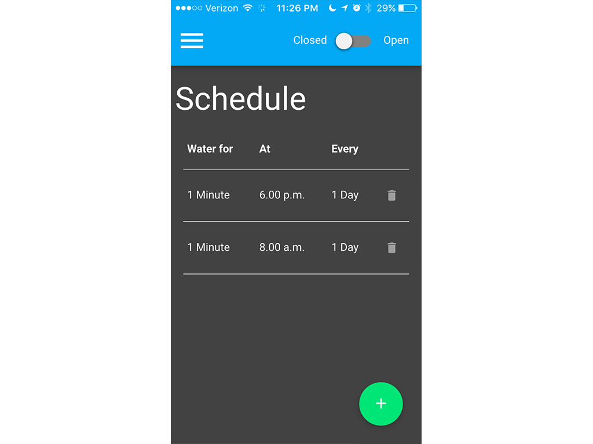
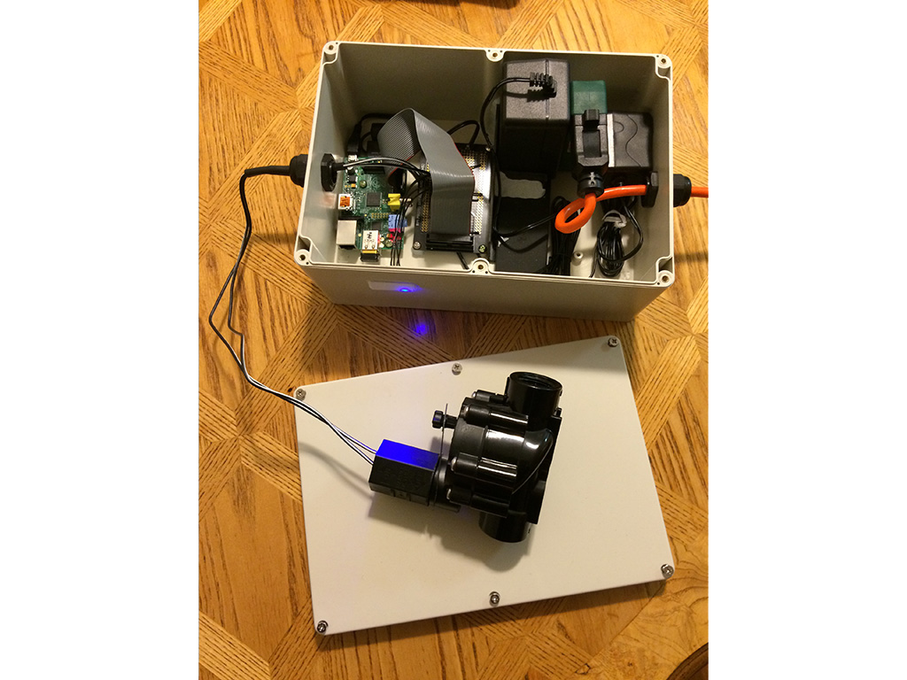
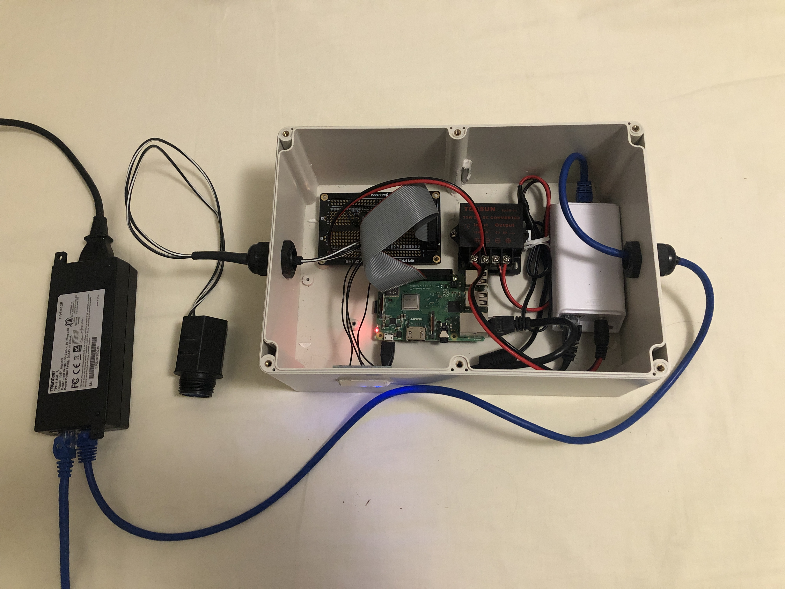

# it-gets-the-hose-again
It-Gets-The-Hose-Again is a Raspberry Pi (compatible with A,B,A+,B+,2, 3, 4, and Zero) controlled Garden sprinkler system that can be controlled via a built in web UI or by HomeKit compatible Apps. This repo includes the source & installation instructions for controller software as well as schematics for the hardware components that need to be added to your Pi in order for the software to control sprinkler hardware.

[Software](web/README.md)
=========================
The controller software is built on Node.js with React.js powering a web UI front end. The software allows a configurable watering schedule and uses [OpenWeatherMap](http://openweathermap.org) to save water by not watering if it is already raining. The controller software is also compatible with Apple [HomeKit](http://www.apple.com/ios/homekit) if you wish to control the sprinkler via HomeKit instead of via the web UI.

[Hardware](hardware/README.md)
==============================
The hardware consists of a small circuit to allow the Pi to control a 24vAC/DC solenoid water valve such as [this one](http://www.amazon.com/gp/product/B00002N8NV), and a 3 LED status panel. Valves using different voltages etc should also work with this control circuit, though this has not been tested.

Version 1
---------
Powered by an AC connection into the enclosure & separate 5v and 24v DC adapters for the Pi and solenoid valve. This configuration requires a Wifi connection to the Pi.

Version 2
---------
Powered by a PoE+ (power-over-ethernet 802.3at) connection (driven by an injector [like this](https://www.amazon.com/gp/product/B00BK4W8TQ/ref=ppx_yo_dt_b_asin_title_o04_s03?ie=UTF8&psc=1)) into the enclosure with a 24v DC PoE+ splitter ([like this](https://www.amazon.com/gp/product/B07FHSSPR1/ref=ppx_yo_dt_b_asin_title_o04_s03?ie=UTF8&psc=1)) that powers the solenoid valve & an additional 24v->5v stepdown transformer ([like this](https://www.amazon.com/gp/product/B00J3MHT1E/ref=ppx_yo_dt_b_asin_title_o04_s02?ie=UTF8&psc=1)) for powering the Pi. This configuration doesn't require Wifi as the PoE connection also provides wired data access.
*NOTE*: PoE (802.3af) might work for this configuration, but its cutting the power requirements pretty tight - standard PoE can provide 15.4W, which is close to the recommended limit for the Pi 3 of 12.5W or 15W for the Pi 4, without giving much additional ceiling for the valve solenoid.

